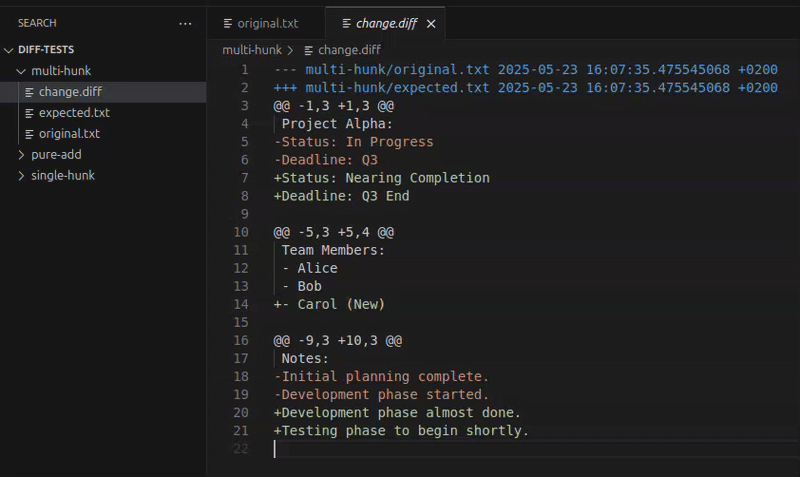

# Quick Diff Apply

Quick Diff Apply is a VS Code extension that lets you interactively apply unified diffs from the clipboard, hunk by hunk, with a visual preview.

## Features

- **Interactive Hunk Review**: Paste a unified diff and review each hunk individually before applying it to your document.
- **Visual Diff Highlighting**: Deleted lines are highlighted, and added lines are shown as phantom text in the editor, providing a clear visual guide.
- **Flexible Application**: Choose to apply or reject each hunk, giving you fine-grained control over the changes.
- **Context Menu Integration**: Easily initiate a diff application by right-clicking on a file in the explorer.

## Usage

1.  **Copy Diff**: Copy a unified diff (e.g., from `git diff -u` or a GitHub PR) to your clipboard.
2.  **Open Target File**: Open the file in VS Code that the diff should be applied to.
3.  **Apply Diff Command**:
    *   Open the Command Palette (Ctrl+Shift+P or Cmd+Shift+P) and type `Quick Diff Apply: Apply Diff from Clipboard`, then press Enter.
    *   Alternatively, right-click the target file in the VS Code Explorer and select "Apply Diff from Clipboard".
4.  **Review Hunks**:
    *   Code lenses will appear above each hunk, allowing you to "Apply this Hunk" or "Reject this Hunk".
    *   Use the commands "Apply All Remaining Hunks in File" or "Discard All Changes in File" for bulk operations.
    *   As hunks are applied or skipped, the view updates to reflect the changes and moves to the next hunk.

## Requirements

- VS Code version 1.99.0 or newer.

## Extension Settings

This extension does not add any VS Code settings.

## Known Issues

- The visual representation of added lines (phantom text) is a simulation. The actual lines are inserted only when a hunk is applied.

## Release Notes

See [CHANGELOG.md](CHANGELOG.md).

## Contributing

Contributions are welcome! Please feel free to submit issues or pull requests.

## License

MIT License

Copyright (c) 2025 NicolasAira

Permission is hereby granted, free of charge, to any person obtaining a copy
of this software and associated documentation files (the "Software"), to deal
in the Software without restriction, including without limitation the rights
to use, copy, modify, merge, publish, distribute, sublicense, and/or sell
copies of the Software, and to permit persons to whom the Software is
furnished to do so, subject to the following conditions:

The above copyright notice and this permission notice shall be included in all
copies or substantial portions of the Software.

THE SOFTWARE IS PROVIDED "AS IS", WITHOUT WARRANTY OF ANY KIND, EXPRESS OR
IMPLIED, INCLUDING BUT NOT LIMITED TO THE WARRANTIES OF MERCHANTABILITY,
FITNESS FOR A PARTICULAR PURPOSE AND NONINFRINGEMENT. IN NO EVENT SHALL THE
AUTHORS OR COPYRIGHT HOLDERS BE LIABLE FOR ANY CLAIM, DAMAGES OR OTHER
LIABILITY, WHETHER IN AN ACTION OF CONTRACT, TORT OR OTHERWISE, ARISING FROM,
OUT OF OR IN CONNECTION WITH THE SOFTWARE OR THE USE OR OTHER DEALINGS IN THE
SOFTWARE.